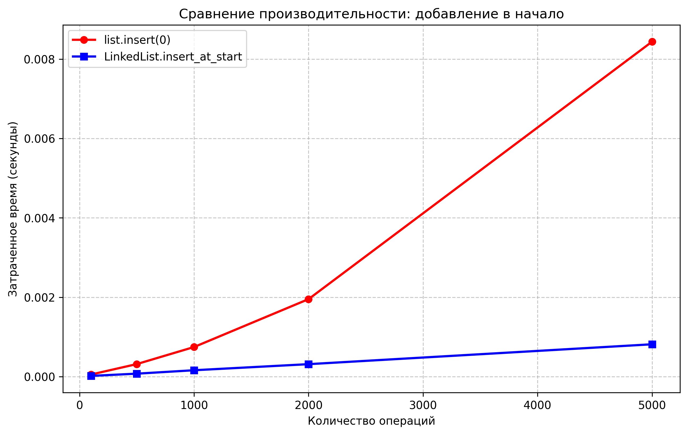
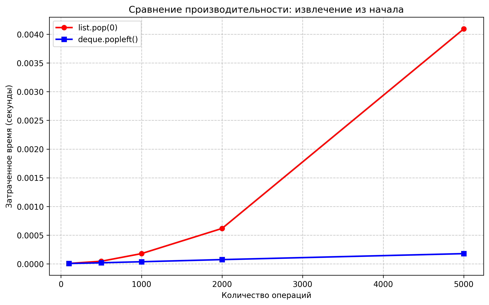

# Отчет по лабораторной работе 02
## Основные структуры данных. Анализ и применение

**Дата:** 2025-12-01  
**Семестр:** 5 семестр  
**Группа:** ПИЖ-б-о-23-1  
**Дисциплина:** Анализ сложности алгоритмов  
**Студент:** Сабодаш Алексей Игоревич

### Цель работы
Изучить понятие и особенности базовых абстрактных типов данных (стек, очередь, дек, связный список) и их реализаций в Python. Научиться выбирать оптимальную структуру данных для решения конкретной задачи, основываясь на анализе теоретической и практической сложности операций. Получить навыки измерения производительности и применения структур данных для решения практических задач.

### Теоретическая часть

**Список (list)** — Реализация динамического массива.
- Обеспечивает амортизированное время O(1) для добавления в конец (append)
- Вставка и удаление в середину имеют сложность O(n) из-за сдвига элементов
- Доступ по индексу — O(1)

**Связный список (Linked List)** — Абстрактная структура данных, состоящая из узлов
- Вставка и удаление в известное место (например, начало списка) выполняются за O(1)
- Доступ по индексу и поиск — O(n)

**Стек (Stack)** — Абстрактный тип данных, работающий по принципу LIFO (Last-In-First-Out)
- Основные операции: push (добавление, O(1)), pop (удаление с вершины, O(1)), peek (просмотр вершины, O(1))
- В Python может быть реализован на основе списка (list)

**Очередь (Queue)** — Абстрактный тип данных, работающий по принципу FIFO (First-In-First-Out)
- Основные операции: enqueue (добавление в конец, O(1)), dequeue (удаление из начала, O(1))
- В Python для эффективной реализации используется collections.deque

**Дек (Deque)** — Двусторонняя очередь, позволяющая добавлять и удалять элементы как в начало, так и в конец
- Все основные операции — O(1)
- В Python реализован в классе collections.deque

### Практическая часть

#### Реализованные методы

**linked_list.py**
- `insert_at_start(data)` — O(1)
- `insert_at_end(data)` — O(1) с поддержкой tail
- `delete_from_start()` — O(1)
- `traversal()` — O(n)
- `size()` — O(n)

**task_solutions.py**
- `is_balanced_brackets()` — O(n) - проверка сбалансированности скобок с использованием стека
- `is_palindrome_deque()` — O(n) - проверка палиндрома с использованием дека
- `print_queue_simulation()` — O(n) - симуляция обработки задач в очереди печати

#### Характеристики ПК для тестирования
- **Процессор:** AMD Ryzen 5 5600G @ 4.3GHz
- **Оперативная память:** 16 GB DDR4
- **ОС:** Windows 11
- **Python:** 3.13

## Графики производительности

### 1. Сравнение вставки в начало

**Анализ:**
- `LinkedList.insert_at_start` — O(1) (постоянное время)
- `list.insert(0)` — O(n) (линейный рост)

### 2. Сравнение операций очереди

**Анализ:**
- `deque.popleft()` — O(1) (эффективная реализация)
- `list.pop(0)` — O(n) (требует сдвига элементов)

#### Результаты решения практических задач

**1. Проверка сбалансированности скобок**
- Использован стек на основе list
- Успешно протестированы различные комбинации скобок
- Все тестовые случаи обработаны корректно

**2. Проверка палиндромов**
- Использован deque для эффективной проверки с двух концов
- Протестированы строки на русском и английском языках
- Числовые последовательности также корректно обработаны

**3. Симуляция очереди печати**
- Реализована на основе deque
- Наглядно продемонстрирован принцип FIFO
- Все задачи обработаны в порядке поступления

### Общие выводы

1. **Экспериментальное подтверждение асимптотической сложности:**
   - `LinkedList.insert_at_start` и `deque.popleft()` — O(1)
   - `list.insert(0)` и `list.pop(0)` — O(n)

2. **Рекомендации по выбору структур данных:**
   - Для операций в начале структуры данных предпочтительнее использовать LinkedList или deque
   - Python-список эффективен как динамический массив для доступа по индексу и добавления в конец
   - Для частых операций в начале/конце следует использовать deque

3. **Практическая значимость:**
   - Реализованные алгоритмы демонстрируют эффективное применение структур данных
   - Выбор оптимальной структуры данных существенно влияет на производительность

### Контрольные вопросы

**1. В чем ключевое отличие динамического массива (list в Python) от связного списка с точки зрения сложности операций вставки в начало и доступа по индексу?**

- **Доступ по индексу:**
  - Динамический массив (list): O(1) — прямой доступ к элементу
  - Связный список: O(n) — нужно пройти по узлам от начала

- **Вставка в начало:**
  - Динамический массив: O(n) — требует сдвига всех элементов
  - Связный список: O(1) — только изменение ссылок head

**2. Объясните принцип работы стека (LIFO) и очереди (FIFO). Приведите по два примера их практического использования.**

**Стек (LIFO — Last In, First Out):**
- Последний добавленный элемент извлекается первым
- Примеры:
  - Реализация функции undo в текстовых редакторах
  - Проверка сбалансированности скобок (как в реализованной задаче)

**Очередь (FIFO — First In, First Out):**
- Первый добавленный элемент извлекается первым
- Примеры:
  - Очередь печати документов (как в реализованной симуляции)
  - Обработка запросов на сервере

**3. Почему операция удаления первого элемента из списка (list) в Python имеет сложность O(n), а из дека (deque) — O(1)?**

- **list:** Удаление первого элемента требует сдвига всех остальных элементов на одну позицию — O(n)
- **deque:** Реализован как двусвязный список или кольцевой буфер, поэтому удаление первого элемента происходит за O(1) без сдвига остальных элементов

**4. Какую структуру данных вы бы выбрали для реализации системы отмены действий (undo) в текстовом редакторе? Обоснуйте свой выбор.**

**Выбор:** стек (LIFO)  
**Обоснование:** Последнее выполненное действие должно быть первым, которое можно отменить. Стек идеально подходит под принцип LIFO — последнее добавленное действие извлекается первым. Это соответствует реализации проверки скобок в работе, где стек использовался для отслеживания последних открытых скобок.

**5. Замеры показали, что вставка 1000 элементов в начало списка заняла значительно больше времени, чем вставка в начало вашей реализации связного списка. Объясните результаты с точки зрения асимптотической сложности.**

- **list:** Вставка в начало требует сдвига всех элементов — O(n) для каждой вставки, 1000 вставок ≈ O(n·1000)
- **Связный список:** Вставка в начало через изменение указателей — O(1) для каждой вставки, 1000 вставок ≈ O(1000)

**Вывод:** Динамический массив медленнее при вставке в начало из-за необходимости сдвига элементов, что подтверждается графиками производительности. Связный список выполняет эту операцию быстро благодаря изменению указателей, что делает его предпочтительным для частых операций вставки/удаления в начале.