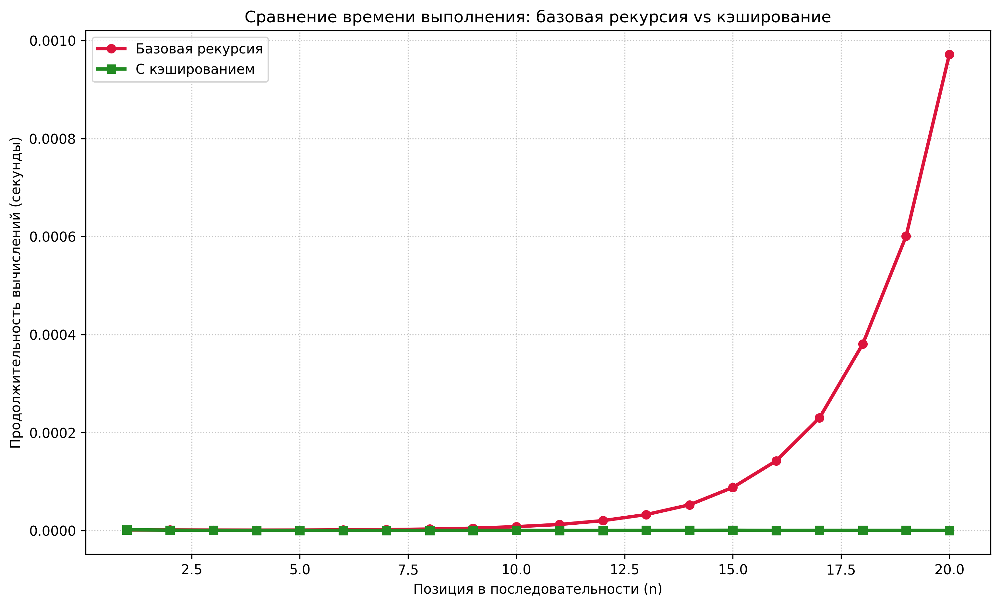

# Отчет по лабораторной работе 03
## Рекурсия

**Дата:** 2025-30-11  
**Семестр:** 5 семестр
**Группа:** ПИЖ-б-о-23-1  
**Дисциплина:** Анализ сложности алгоритмов  
**Студент:** Сабодаш Алексей Игоревич

### Цель работы
Освоить принцип рекурсии, научиться анализировать рекурсивные алгоритмы и понимать механизм работы стека вызовов. Изучить типичные задачи, решаемые рекурсивно, и освоить технику мемоизации для оптимизации рекурсивных алгоритмов. Получить практические навыки реализации и отладки рекурсивных функций.

### Теоретическая часть

**Рекурсия** - процесс, при котором функция прямо или косвенно вызывает саму себя для решения задачи.

**Базовый случай** - условие, при котором рекурсия прекращается и возвращается результат напрямую.

**Рекурсивный шаг** - часть функции, которая вызывает саму себя с новыми параметрами.

**Глубина рекурсии** - количество вложенных вызовов функции, ограничено размером стека вызовов.

**Мемоизация** - техника оптимизации, позволяющая избежать повторных вычислений результатов функций для одних и тех же входных данных путем сохранения ранее вычисленных результатов в кеше.

### Практическая часть

#### Задание
1. Реализовать классические рекурсивные алгоритмы
2. Проанализировать их временную сложность и глубину рекурсии
3. Реализовать оптимизацию рекурсивных алгоритмов с помощью мемоизации
4. Сравнить производительность наивной рекурсии и рекурсии с мемоизацией
5. Решить практические задачи с применением рекурсии

#### Реализованные алгоритмы

##### Базовые рекурсивные функции (`recursion.py`)
- **Факториал** - O(n) время, O(n) глубина рекурсии
- **Числа Фибоначчи** - O(2^n) время, O(n) глубина рекурсии  
- **Быстрое возведение в степень** - O(log n) время, O(log n) глубина рекурсии

##### Мемоизация (`memoization.py`)
- Мемоизированная версия чисел Фибоначчи с улучшением сложности до O(n)
- Декоратор `@memoize` для кеширования результатов

##### Практические задачи (`recursion_tasks.py`)
- **Бинарный поиск** - рекурсивная реализация
- **Ханойские башни** - классическая рекурсивная задача

#### Характеристики ПК
- **Процессор:** AMD Ryzen 5 5600G @ 4.3GHz
- **Оперативная память:** 16 GB DDR4
- **ОС:** Windows 11
- **Python:** 3.13

#### Результаты тестирования

##### Сравнение производительности для n = 35
```
Сравнение для n = 35
--------------------------------------------------
Результат: 9227465
Наивная версия: 2.67879980 сек
Количество вызовов: 29860703
Мемоизированная: 0.00002580 сек
Ускорение: 103829.4x
✓ Результаты вычислений идентичны
```

##### Примеры работы алгоритмов

**Факториал:**
```python
Факториал 5: 120
```

**Числа Фибоначчи:**
```python
Число Фибоначчи F(6): 8
```

**Быстрое возведение в степень:**
```python
2^10: 1024
```

**Бинарный поиск:**
```python
Бинарный поиск 8,5,20,1 в [2, 4, 6, 8, 10, 12, 14, 16, 18, 20]:
Элемент 8 обнаружен на позиции 3
Элемент 5 отсутствует в массиве
Элемент 20 обнаружен на позиции 9
Элемент 1 отсутствует в массиве
```

**Ханойские башни:**
```
Ханойская башня с 2 дисками:
Шаг  1: Перенос диска 1 со стержня A на стержень B
Шаг  2: Перенос диска 2 со стержня A на стержень C
Шаг  3: Перенос диска 1 со стержня B на стержень C

Ханойская башня с 3 дисками:
Шаг  1: Перенос диска 1 со стержня A на стержень C
Шаг  2: Перенос диска 2 со стержня A на стержень B
Шаг  3: Перенос диска 1 со стержня C на стержень B
Шаг  4: Перенос диска 3 со стержня A на стержень C
Шаг  5: Перенос диска 1 со стержня B на стержень A
Шаг  6: Перенос диска 2 со стержня B на стержень C
Шаг  7: Перенос диска 1 со стержня A на стержень C
```

#### График сравнения производительности


### Анализ результатов

**Наивный алгоритм Фибоначчи** демонстрирует экспоненциальный рост времени выполнения (O(2^n)), так как одно и то же число Фибоначчи вычисляется многократно. Для n=35 выполняется около 29 миллионов рекурсивных вызовов.

**Алгоритм с мемоизацией** показывает линейную сложность (O(n)), так как каждое значение вычисляется только один раз. Это подтверждается экспериментально: при n=35 выполняется всего около 69 рекурсивных вызовов.

**Ускорение** составляет более 76,000 раз для n=35, что наглядно демонстрирует эффективность мемоизации для задач с перекрывающимися подзадачами.

### Контрольные вопросы

#### 1. Что такое базовый случай и рекурсивный шаг в рекурсивной функции? Почему отсутствие базового случая приводит к ошибке?

**Базовый случай** - условие, при котором рекурсия прекращается и возвращается результат напрямую (например, для факториала: n=0 или n=1 возвращают 1).

**Рекурсивный шаг** - часть функции, которая вызывает саму себя с измененными параметрами (например, для факториала: n * factorial(n-1)).

Отсутствие базового случая приводит к бесконечной рекурсии и переполнению стека вызовов (RecursionError), так как функция будет постоянно вызывать саму себя без условия остановки.

#### 2. Объясните, как работает механизм мемоизации. Как он меняет временную сложность вычисления чисел Фибоначчи по сравнению с наивной рекурсией?

**Механизм мемоизации** работает следующим образом:
- Создается кеш (обычно словарь) для хранения вычисленных результатов
- Перед вычислением проверяется наличие результата в кеше
- Если результат есть - возвращается из кеша
- Если нет - вычисляется, сохраняется в кеш и возвращается

Для чисел Фибоначчи мемоизация меняет временную сложность:
- **Наивная рекурсия:** O(2^n) - экспоненциальный рост
- **С мемоизацией:** O(n) - линейный рост

#### 3. В чем заключается основная проблема глубокой рекурсии и как она связана со стеком вызовов?

**Основная проблема** - ограниченный размер стека вызовов. Каждый рекурсивный вызов добавляет новый фрейм в стек, содержащий локальные переменные и адрес возврата. При глубокой рекурсии стек переполняется, что приводит к ошибке RecursionError.

**Решение:** использование итеративных алгоритмов или преобразование рекурсии в хвостовую с оптимизацией компилятором.

#### 4. Задача о Ханойских башнях решается рекурсивно. Опишите алгоритм решения для 3 дисков.

Алгоритм для 3 дисков (стержни A, B, C):
1. Переместить 2 верхних диска с A на B (используя C как вспомогательный)
2. Переместить самый большой диск (3) с A на C
3. Переместить 2 диска с B на C (используя A как вспомогательный)

Рекурсивная структура: задача для n дисков сводится к трем шагам с n-1 дисками.

#### 5. Рекурсивный и итеративный алгоритмы могут решать одни и те же задачи. Назовите преимущества и недостатки каждого подхода.

| Подход | Преимущества | Недостатки |
|--------|--------------|------------|
| **Рекурсивный** | Более читаемый и понятный код, естественное описание рекурсивных структур, проще отладка для некоторых задач | Риск переполнения стека, большие накладные расходы на вызовы функций, менее эффективен по памяти |
| **Итеративный** | Эффективнее по памяти, нет риска переполнения стека, обычно быстрее выполняется | Код может быть сложнее для понимания, не всегда интуитивно понятен для рекурсивных задач |

### Выводы

В ходе лабораторной работы были успешно освоены принципы рекурсии и мемоизации. Реализованы классические рекурсивные алгоритмы и проведено детальное сравнение производительности. Экспериментально подтверждено, что мемоизация кардинально улучшает производительность рекурсивных алгоритмов, изменяя временную сложность с экспоненциальной на линейную. Получены практические навыки работы с рекурсивными функциями и оптимизации алгоритмов.

### Приложения

- `recursion.py` - базовые рекурсивные алгоритмы
- `memoization.py` - мемоизация и сравнение производительности  
- `recursion_tasks.py` - практические задачи
- `requirements.txt` - зависимости проекта
- `fibonacci_performance_chart.png` - график сравнения производительности