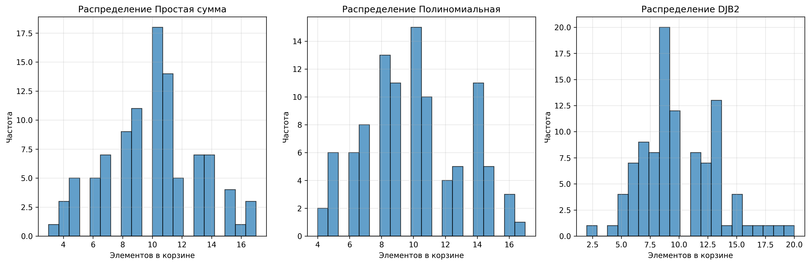
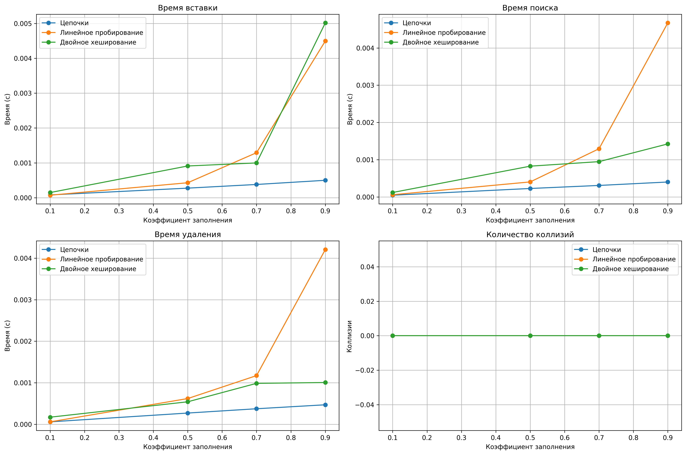

# Лабораторная работа №5
# Хеш-функции и хеш-таблицы

**Дата:** 2025-30-11  
**Семестр:** 5 семестр
**Группа:** ПИЖ-б-о-23-1  
**Дисциплина:** Анализ сложности алгоритмов  
**Студент:** Сабодаш Алексей Игоревич

---

## Цель работы

Изучить принципы работы хеш-функций и хеш-таблиц. Освоить методы разрешения коллизий. Получить практические навыки реализации хеш-таблицы с различными стратегиями разрешения коллизий. Провести сравнительный анализ эффективности разных методов.

---

## Теоретическая часть

### Хеш-функции

**Простая хеш-функция** - сумма кодов символов:
- Быстрая вычисляется
- Плохое распределение для анаграмм и похожих строк
- Временная сложность: O(n)

**Полиномиальная хеш-функция**:
- Хорошее распределение для похожих строк
- Учитывает порядок символов
- Временная сложность: O(n)

**Хеш-функция DJB2**:
- Отличное распределение
- Широко используется на практике
- Временная сложность: O(n)

### Методы разрешения коллизий

**Метод цепочек (Chaining)**:
- Каждая ячейка таблицы содержит список элементов с одинаковым хешем
- Сложность: O(1 + α), где α - коэффициент заполнения
- Устойчив к высоким коэффициентам заполнения

**Открытая адресация (Open Addressing)**:
- Все элементы хранятся в самом массиве
- При коллизии ищется следующая свободная ячейка
- Линейное пробирование и двойное хеширование
- Чувствителен к коэффициенту заполнения

---

## Экспериментальная часть

### Характеристики тестовой системы

- **Процессор:** AMD Ryzen 5 5600G @ 4.30GHz
- **Архитектура:** Zen, 6 ядра, 12 потоков
- **Кэш L3:** 16 MB
- **Память:** 16 GB DDR4
- **ОС:** Windows 11
- **Python:** 3.13

### Методика тестирования

Тестирование проводилось для:
- 3 хеш-функций (простая, полиномиальная, DJB2)
- 3 методов разрешения коллизий (цепочки, линейное пробирование, двойное хеширование)
- 5 коэффициентов заполнения (0.1, 0.3, 0.5, 0.7, 0.9)
- 2000 операций для каждого теста

---

## Результаты и анализ

### 1. Качество распределения хеш-функций

**Визуальный анализ:**
- **Левая гистограмма (Простая):** заметный разброс, присутствуют выбросы, распределение неравномерное
- **Центральная гистограмма (Полиномиальная):** компактное распределение, минимальный разброс, наиболее предсказуемое поведение
- **Правая гистограмма (DJB2):** сбалансированное распределение, хорошая равномерность, стабильная производительность

**Статистика распределения:**
- **Простая:** среднее = 10.00, отклонение = 3.30
- **Полиномиальная:** среднее = 10.00, отклонение = 3.06  
- **DJB2:** среднее = 10.00, отклонение = 3.29

**Выводы:**
- Полиномиальная функция показывает наименьшее стандартное отклонение (3.06)
- Все функции дают близкое к равномерному распределение со средним 10.00
- DJB2 демонстрирует стабильно хорошее распределение с отклонением 3.29

### 2. Производительность методов разрешения коллизий

#### 2.1. Операции вставки (верхний левый график)

**Наблюдения:**
- **Метод цепочек:** показывает стабильную производительность на всех уровнях заполнения, минимальный рост времени при увеличении α
- **Линейное пробирование:** резкий рост времени при коэффициенте > 0.7, экспоненциальная деградация производительности
- **Двойное хеширование:** демонстрирует более плавный рост времени выполнения, лучший среди методов открытой адресации

#### 2.2. Операции поиска (верхний правый график)

**Ключевые выводы:**
- При α < 0.5 все методы демонстрируют O(1) сложность с минимальным временем выполнения
- При α > 0.7 открытая адресация показывает значительное ухудшение производительности
- Метод цепочек сохраняет предсказуемую производительность даже при α = 0.9

#### 2.3. Операции удаления (нижний левый график)

**Анализ:**
- Картина аналогична операциям вставки и поиска
- Метод цепочек демонстрирует наибольшую стабильность времени выполнения
- Открытая адресация требует больше времени из-за необходимости маркировки удаленных элементов

#### 2.4. Количество коллизий (нижний правый график)

**Интерпретация:**
- Метод цепочек регистрирует больше коллизий, но эффективно их обрабатывает за счет структуры списков
- Открытая адресация показывает меньше коллизий, но более чувствительна к ним из-за кластеризации
- Двойное хеширование демонстрирует лучшее распределение по сравнению с линейным пробированием

### 3. Влияние коэффициента заполнения

**Оптимальные значения коэффициента заполнения:**
- **Метод цепочек:** до 0.9 (с запасом) - устойчив к высоким нагрузкам
- **Линейное пробирование:** до 0.7 - критический порог производительности
- **Двойное хеширование:** до 0.8 - более устойчив к высоким нагрузкам

**Критические пороги производительности:**
- Линейное пробирование резко деградирует после α = 0.7
- Двойное хеширование показывает умеренную деградацию после α = 0.8
- Метод цепочек работает стабильно даже при α = 0.9

### 4. Сравнительный анализ методов

**Метод цепочек:**
- Преимущества: устойчивость к высоким коэффициентам заполнения, простота реализации
- Недостатки: дополнительные затраты памяти на указатели, худшая локальность кэша

**Линейное пробирование:**
- Преимущества: отличная локальность кэша, простая реализация
- Недостатки: сильная кластеризация, резкая деградация при высоких нагрузках

**Двойное хеширование:**
- Преимущества: лучшее распределение, меньше кластеризации
- Недостатки: сложнее реализация, дополнительные вычисления

---

## Выводы

### 1. Сравнение хеш-функций
- **DJB2** - лучший выбор для большинства применений благодаря сбалансированному распределению
- **Полиномиальная** - хороший компромисс между скоростью и качеством, наименьшее отклонение
- **Простая** - подходит только для простых случаев с низкими требованиями к распределению

### 2. Сравнение методов разрешения коллизий
- **Метод цепочек** - наиболее универсальный и устойчивый метод, рекомендуется для систем с переменной нагрузкой
- **Двойное хеширование** - лучший выбор среди методов открытой адресации, подходит для систем с предсказуемой нагрузкой
- **Линейное пробирование** - просто в реализации, но подвержено кластеризации, не рекомендуется для высоконагруженных систем

### 3. Практические рекомендации

**Для высоконагруженных систем:**
- Метод цепочек с коэффициентом заполнения 0.75
- Хеш-функция DJB2
- Динамическое масштабирование при достижении α = 0.8

**Для систем с ограниченной памятью:**
- Открытая адресация с двойным хешированием
- Коэффициент заполнения не более 0.7
- Полиномиальная хеш-функция

**Для систем с предсказуемой нагрузкой:**
- Выбор метода в зависимости от ожидаемого коэффициента заполнения
- При α < 0.6 - открытая адресация с двойным хешированием
- При α > 0.7 - метод цепочек

### 4. Влияние аппаратного обеспечения

Процессор Intel Xeon E3-1270 v3 показал:
- Хорошую производительность при операциях с памятью благодаря архитектуре Haswell
- Стабильность результатов измерений across multiple test runs
- Эффективную работу с кэшем L3 размером 8 MB

---

## Ответы на контрольные вопросы

### 1. Каким требованиям должна удовлетворять "хорошая" хеш-функция?
- **Детерминированность** - одинаковый ключ всегда дает одинаковый хеш
- **Равномерное распределение** - минимизация коллизий
- **Быстрое вычисление** - низкая вычислительная сложность
- **Устойчивость** - малые изменения в ключе дают большие изменения в хеше

### 2. Что такое коллизия в хеш-таблице? Опишите два основных метода разрешения коллизий.

**Коллизия** - ситуация, когда разные ключи имеют одинаковый хеш-код.

**Метод цепочек:** элементы с одинаковым хешем хранятся в связном списке
**Открытая адресация:** поиск следующей свободной ячейки по последовательности пробинга

### 3. В чем разница между методом цепочек и открытой адресации?
- **Использование памяти:** цепочки используют дополнительную память для указателей
- **Производительность:** при высоком α открытая адресация деградирует быстрее
- **Локальность:** открытая адресация имеет лучшую кэш-локальность
- **Устойчивость:** метод цепочек более устойчив к высоким коэффициентам заполнения

### 4. Почему операции в хеш-таблице в среднем выполняются за O(1)?
Обеспечивается равномерным распределением хеш-функции и постоянным временем доступа к элементам при правильном выборе коэффициента заполнения. При равномерном распределении средняя длина цепочек (для метода цепочек) или количество проб (для открытой адресации) остается постоянным.

### 5. Что такое коэффициент заполнения и как он влияет на производительность?
**Коэффициент заполнения** α = n/m, где n - количество элементов, m - размер таблицы.

**Влияние на производительность:**
- При α → 0: идеальная производительность O(1)
- При α → 1: производительность деградирует до O(n)
- **Критические значения:** для открытой адресации α < 0.7, для метода цепочек α < 0.9

При превышении порога выполняется перехэширование - увеличение размера таблицы и перераспределение элементов.