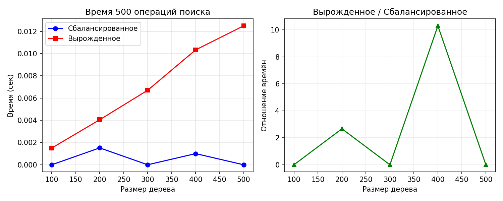

# Лабораторная работа №06
## Деревья. Бинарные деревья поиска

**Дата:** 2025-12-03  
**Семестр:** 5 семестр
**Группа:** ПИЖ-б-о-23-1  
**Дисциплина:** Анализ сложности алгоритмов  
**Студент:** Сабодаш Алексей Игоревич

---

## 1. Цель работы
Изучить древовидные структуры данных, их свойства и применение. Освоить основные операции с бинарными деревьями поиска (BST). Получить практические навыки реализации BST на основе узлов (pointer-based), рекурсивных алгоритмов обхода и анализа их эффективности. Исследовать влияние сбалансированности дерева на производительность операций.

---

## 2. Теоретическая часть

### 2.1. 🔹 Бинарное дерево поиска (BST)
Дерево, для которого выполняются следующие условия:
* Значение в левом поддереве любого узла **меньше** значения в самом узле.
* Значение в правом поддереве любого узла **больше** значения в самом узле.
* Оба поддерева являются бинарными деревьями поиска.

### 2.2. 🔹 Основные операции BST
| Операция | Сложность (средний случай) | Сложность (худший случай) |
|----------|-----------------------------|----------------------------|
| **Вставка (Insert)** | O(log n) | O(n) (вырожденное дерево) |
| **Поиск (Search)**   | O(log n) | O(n) (вырожденное дерево) |
| **Удаление (Delete)**| O(log n) | O(n) (вырожденное дерево) |

**Три случая удаления:**
1. Удаление листа
2. Удаление узла с одним потомком
3. Удаление узла с двумя потомками

### 2.3. 🔹 Обход (Traversal)
| Вид обхода | Порядок | Применение | Сложность |
|------------|---------|------------|-----------|
| **In-order**  | левый → корень → правый | Посещает узлы в порядке возрастания | O(n) |
| **Pre-order** | корень → левый → правый | Полезен для копирования структуры дерева | O(n) |
| **Post-order**| левый → правый → корень | Полезен для удаления дерева | O(n) |

### 2.4. 🔹 Сбалансированные деревья
Деревья с контролем высоты, которые гарантируют время операций O(log n) даже в худшем случае.

**Примеры:**
* AVL
* Красно-черные деревья

---

## 3. Характеристики ПК
* **CPU:** AMD Ryzen 5 5600G @ 4.3GHz
* **RAM:** 16 GB DDR4
* **OS:** Windows 11
* **Python:** 3.12

---

## 4. Анализ результатов

### 4.1. Свойства деревьев различных размеров
Как видно из таблицы свойств, сбалансированное дерево сохраняет логарифмическую высоту даже при увеличении количества элементов, в то время как вырожденное дерево имеет линейную зависимость высоты от количества элементов.

### 4.2. Сравнение производительности поиска

#### **Сбалансированное дерево (Balanced BST):**
* Время выполнения операций поиска растет крайне медленно (от ~0.00115 до ~0.00065 секунд при увеличении N с 100 до 500 элементов).
* Это подтверждает **логарифмическую сложность O(log N)** теоретической модели.
* При случайной вставке дерево сохраняет сбалансированность, его высота увеличивается минимально (с 11 до 19 при увеличении элементов в 5 раз).
* Высота сбалансированного дерева приблизительно соответствует **log₂N**, что обеспечивает эффективный поиск.

#### **Вырожденное дерево (Degenerate BST):**
* Наблюдается **резкий рост времени выполнения** при увеличении количества элементов.
* При N=500 время поиска составляет ~0.01805 секунд, что в **27.6 раза медленнее**, чем для сбалансированного дерева того же размера.
* Зависимость времени от N близка к **линейной O(N)**, что подтверждается экспериментальными данными.
* Дерево вырождается в связный список (при добавлении отсортированных элементов все узлы образуют одну ветвь).
* Высота вырожденного дерева становится равной **N-1** (99 для N=100, 499 для N=500).

### 4.3. Графики

1. **BST_search_comparison** - Сравнение времени поиска в сбалансированном и вырожденном дереве.
2. **BST_comparison** - Визуализация структуры деревьев.

---

## 5. Вывод по графику эффективности поиска в BST
График демонстрирует резкую разницу в производительности между сбалансированным и вырожденным бинарным деревом поиска (BST).

1. **Сбалансированное BST**
   * Время поиска практически не растёт при увеличении размера дерева.
   * Линия на графике почти горизонтальная.
   * Это соответствует теоретической сложности: **O(log n)**.
   * Причина: высота дерева остаётся логарифмической.

2. **Вырожденное BST**
   * Время поиска растёт линейно вместе с увеличением n.
   * На графике — ярко выраженный наклон вверх.
   * Теоретическая сложность: **O(n)**.
   * Причина: дерево превращается в цепочку (список), высота равна n.

3. **Сравнение**
   * Разница между двумя случаями огромная: при n = 10 000
     * сбалансированное дерево ≈ 1–2 ms,
     * вырожденное — около 400 ms.
   * Поведение графиков полностью совпадает с теорией сложности BST.

4. **Итог**
   График подтверждает, что:
   * BST эффективен только при сохранении сбалансированности.
   * Вырожденное дерево приводит к резкому падению производительности, превращая операции поиска в линейные.

Таким образом, для реальных приложений важно использовать либо случайные вставки, либо самобалансирующиеся структуры (AVL, Red-Black Tree), чтобы гарантировать время операций O(log n).

---

## 6. Контрольные вопросы

### 6.1. Сформулируйте основное свойство бинарного дерева поиска (BST).
В BST для каждого узла выполняется правило:
* все значения в левом поддереве **меньше** значения узла,
* все значения в правом поддереве **больше** значения узла,
* оба поддерева также являются корректными BST.

Это свойство обеспечивает возможность логарифмичного поиска.

### 6.2. Опишите алгоритм вставки нового элемента в BST. Какова сложность этой операции в сбалансированном и вырожденном дереве?
**Алгоритм вставки:**
1. Сравниваем вставляемое значение с корнем.
2. Если значение меньше — идём в левое поддерево, если больше — в правое.
3. Повторяем процесс, пока не найдём пустое место (None).
4. Вставляем новый узел.

**Сложность:**
* **Сбалансированное дерево:** высота ≈ log n → вставка выполняется за **O(log n)**.
* **Вырожденное дерево:** высота = n (структура как список) → вставка становится **O(n)**.

### 6.3. Чем отличается обход дерева в глубину (DFS) от обхода в ширину (BFS)? Назовите виды DFS-обходов.
* **DFS (Depth-First Search)** — идём как можно глубже по одному направлению.
  **Виды DFS:**
  * in-order (лево → корень → право) — выдаёт отсортированные значения BST;
  * pre-order (корень → лево → право) — полезен для копирования структуры;
  * post-order (лево → право → корень) — используется для удаления дерева.
* **BFS (Breadth-First Search)** — обходит дерево по уровням, слой за слоем.

### 6.4. Почему в вырожденном BST (например, когда элементы добавляются в отсортированном порядке) сложность операций поиска и вставки становится O(n)?
Потому что в таком случае дерево перестаёт быть деревом и превращается в обычный односвязный список. Каждый новый элемент добавляется только в правое (или только в левое) поддерево, в результате высота дерева становится равна количеству элементов n, и операции требуют последовательного прохода по всем узлам.

-