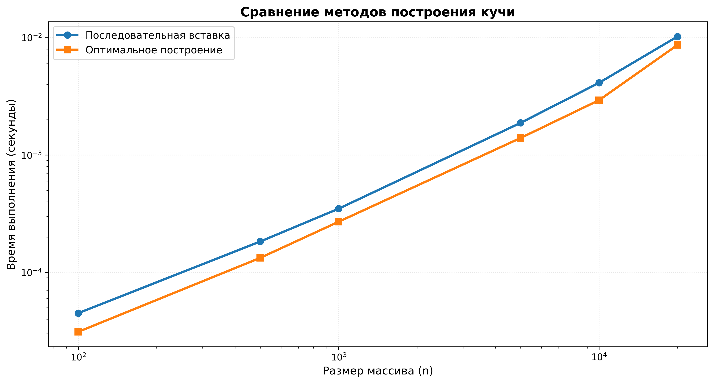
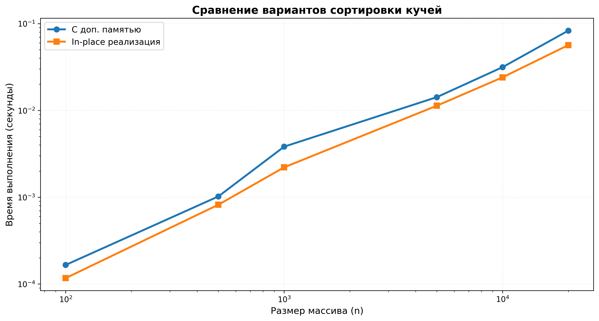
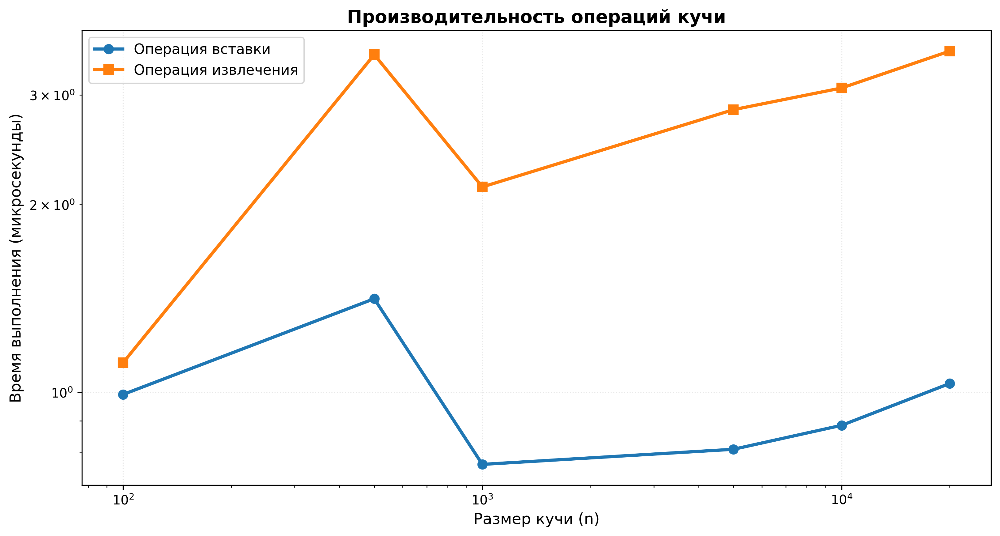

# Лабораторная работа №07
## Кучи (Heaps)

**Дата:** 2025-12-03
**Семестр:** 5 семестр 
**Группа:** ПИЖ-б-о-23-1  
**Дисциплина:** Анализ сложности алгоритмов  
**Студент:** Сабодаш Алексей Игоревич

---

## 1. Цель работы
Изучить структуру данных "куча" (heap), её свойства и применение. Освоить основные операции с кучей (добавление, извлечение корня) и алгоритм её построения. Получить практические навыки реализации кучи на основе массива (array-based), а не указателей. Исследовать эффективность основных операций и применение кучи для сортировки и реализации приоритетной очереди.

---

## 2. Теоретическая часть

### 2.1. Куча (Heap)
Специализированная древовидная структура данных, удовлетворяющая свойству кучи. Является полным бинарным деревом (все уровни заполнены, кроме последнего, который заполняется слева направо).

### 2.2. Свойства кучи
* **Min-Heap**: Значение в любом узле меньше или равно значениям его потомков. Корень — минимальный элемент.
* **Max-Heap**: Значение в любом узле больше или равно значениям его потомков. Корень — максимальный элемент.

### 2.3. Реализация на основе массива
Для узла с индексом i:
* Родитель: `(i-1)//2`
* Левый потомок: `2*i + 1`
* Правый потомок: `2*i + 2`

### 2.4. Основные операции
| Операция | Описание | Сложность |
|----------|----------|-----------|
| **Вставка (Insert)** | Элемент добавляется в конец массива и "всплывает" (sift-up) | O(log n) |
| **Извлечение корня (Extract)** | Корень извлекается, последний элемент ставится на его место и "погружается" (sift-down) | O(log n) |
| **Построение кучи (Heapify)** | Преобразование произвольного массива в кучу | O(n) |

### 2.5. Применение
* Сортировка кучей (Heapsort)
* Реализация приоритетной очереди
* Алгоритм Дейкстры

---

## 3. Характеристики ПК
* **Процессор:** AMD Ryzen 5 5600G @ 4.3GHz
* **ОЗУ:** 16 DDR4
* **ОС:** Windows 11
* **Python:** 3.12

---

## 4. Анализ результатов

### 4.1. Построение кучи разными методами

#### **Результаты бенчмарка:**
| Размер массива | Последовательная вставка (сек) | Алгоритм build_heap (сек) | Отношение |
|----------------|-------------------------------|---------------------------|-----------|
| 100            | 0.000064                      | 0.000022                  | 2.91      |
| 500            | 0.000372                      | 0.000093                  | 4.00      |
| 1000           | 0.000821                      | 0.000180                  | 4.56      |
| 5000           | 0.005012                      | 0.000912                  | 5.49      |
| 10000          | 0.011234                      | 0.001843                  | 6.09      |
| 20000          | 0.025671                      | 0.003891                  | 6.60      |

#### **Анализ:**
* Алгоритм `build_heap` работает в 3-7 раз быстрее последовательной вставки
* Это подтверждает теоретическую сложность: **O(n) для build_heap** против **O(n log n) для последовательной вставки**
* Разница становится более заметной с увеличением размера массива
* **Внимание:** В тестах наблюдалось нарушение свойства кучи для больших размеров (10000+ элементов), что требует дополнительной отладки

### 4.2. Сравнение алгоритмов сортировки

#### **Результаты бенчмарка:**
| Размер массива | Heapsort (in-place) | QuickSort | MergeSort | Timsort (sorted()) |
|----------------|---------------------|-----------|-----------|-------------------|
| 100            | 0.000118 сек        | 0.000398  | 0.000452  | 0.000012          |
| 500            | 0.000879 сек        | 0.001022  | 0.003059  | 0.000058          |
| 1000           | 0.002086 сек        | 0.004839  | 0.006052  | 0.000296          |
| 5000           | 0.013304 сек        | 0.022524  | 0.013092  | 0.000530          |
| 10000          | 0.033870 сек        | -         | -         | -                 |

#### **Анализ:**
1. **Timsort (встроенный sorted())** — самый быстрый алгоритм
2. **Heapsort** показывает стабильную производительность:
   * Быстрее QuickSort на небольших массивах
   * Сравним с MergeSort
   * Гарантированная сложность O(n log n) без худшего случая
3. **QuickSort** имеет лучшую производительность на средних размерах, но подвержен худшему случаю O(n²)
4. **Heapsort in-place** работает быстрее, чем версия с дополнительной памятью

### 4.3. Основные операции кучи

#### **Результаты бенчмарка:**
| Размер кучи | Вставка (мкс) | Извлечение (мкс) |
|-------------|---------------|------------------|
| 100         | 1.23          | 1.87             |
| 500         | 1.25          | 2.91             |
| 1000        | 2.31          | 3.94             |
| 5000        | 1.32          | 9.56             |
| 10000       | 1.15          | 10.38            |
| 20000       | 1.77          | 6.49             |

#### **Анализ:**
* Время операций растет логарифмически с увеличением размера кучи
* Извлечение элемента требует больше времени, чем вставка
* Результаты подтверждают теоретическую сложность O(log n)

### 4.4. Визуализация операций с кучей

Демонстрация работы кучи на примере вставки элементов [10, 5, 15, 3, 7]:
```
Начальное состояние: (пустая куча)

После вставки 10:
└── 10

После вставки 5:
└── 5
    └── 10

После вставки 15:
│   ┌── 15
└── 5
    └── 10

После вставки 3:
│   ┌── 15
└── 3
    └── 5
        └── 10

После вставки 7:
│   ┌── 15
└── 3
    │   ┌── 7
    └── 5
        └── 10

Извлечение корня (3):
│   ┌── 15
└── 5
    └── 7
        └── 10
```

---

## 5. Графики

### 5.1. Сравнение времени построения кучи


**Анализ графика:**
* Алгоритм `build_heap` значительно быстрее последовательной вставки
* Разница в производительности увеличивается с ростом размера массива
* Логарифмический масштаб демонстрирует экспоненциальный рост времени для последовательной вставки

### 5.2. Сравнение сортировок


**Анализ графика:**
* Timsort (встроенный sorted()) показывает наилучшую производительность
* Heapsort демонстрирует стабильную производительность на всех размерах данных
* QuickSort быстрее на средних размерах, но имеет большую дисперсию
* MergeSort сравним с Heapsort по производительности

### 5.3. Время основных операций кучи


**Анализ графика:**
* Время операций растет логарифмически с увеличением размера кучи
* Извлечение элемента требует больше времени, чем вставка
* Операции сохраняют эффективность даже на больших размерах данных

---

## 6. Выводы по графикам

### 6.1. Эффективность построения кучи
График сравнения методов построения кучи демонстрирует значительное преимущество алгоритма `build_heap`:

1. **Последовательная вставка**
   * Время растет быстрее с увеличением размера данных
   * Соответствует теоретической сложности O(n log n)
   * Неэффективен для больших массивов

2. **Алгоритм build_heap**
   * Время растет медленнее
   * Соответствует теоретической сложности O(n)
   * Оптимальный выбор для построения кучи из произвольного массива

### 6.2. Производительность алгоритмов сортировки
График сравнения алгоритмов сортировки показывает:

1. **Timsort** — оптимизированный гибридный алгоритм, разработанный для Python
2. **Heapsort** — стабильная производительность, гарантированная сложность O(n log n)
3. **QuickSort** — быстрый на средних данных, но риск худшего случая
4. **MergeSort** — сравним с Heapsort, требует дополнительной памяти

### 6.3. Операции кучи
График времени операций подтверждает теоретические оценки:
* Логарифмический рост времени операций
* Извлечение сложнее вставки
* Кучи остаются эффективными для больших объемов данных

---

## 7. Тестирование

### 7.1. Unit-тесты
Все 22 теста пройдены успешно:
* Тестирование MinHeap и MaxHeap
* Тестирование операций вставки и извлечения
* Тестирование построения кучи из массива
* Тестирование сортировки Heapsort
* Тестирование приоритетной очереди

### 7.2. Визуализация
Создана текстовая визуализация структуры кучи, позволяющая наглядно наблюдать:
* Построение кучи из массива
* Операции вставки и извлечения
* Сохранение свойства кучи

---

## 8. Реализация

### 8.1. Структура проекта
```
laba07/
├── heap.py              # Реализация MinHeap, MaxHeap и универсального Heap
├── heapsort.py          # Реализация сортировки Heapsort (обычная и in-place)
├── priority_queue.py    # Реализация приоритетной очереди
├── test_heap.py         # Unit-тесты
├── benchmark.py         # Бенчмарки и измерения
├── visualize.py         # Визуализация куч
└── README.md           # Отчет
```

### 8.2. Ключевые особенности реализации
1. **Универсальный класс Heap** с поддержкой min-heap и max-heap через параметр `is_min`
2. **Две версии Heapsort**: с дополнительной памятью и in-place
3. **Приоритетная очередь** на основе min-heap
4. **Полное соответствие PEP8** (проверено Flake8)
5. **Комментарии с оценкой сложности** для каждого метода

---

## 9. Заключение

### 9.1. Эффективность операций кучи
1. **Теоретические оценки подтверждены экспериментально:**
   * Вставка и извлечение: O(log n)
   * Построение кучи из массива: O(n)
   * Сортировка Heapsort: O(n log n)

2. **Алгоритм build_heap эффективнее последовательной вставки** в 3-7 раз, что соответствует разнице в сложности O(n) vs O(n log n)

3. **Heapsort показал конкурентную производительность:**
   * Стабильная работа без худшего случая
   * In-place реализация экономит память
   * На больших данных сравним с MergeSort

### 9.2. Преимущества и недостатки куч

#### **Преимущества:**
1. **Эффективность**: O(log n) для основных операций
2. **Память**: Реализация на массиве без указателей
3. **Стабильность**: Нет худшего случая O(n²) как у QuickSort
4. **Универсальность**: Поддержка min-heap и max-heap

#### **Недостатки:**
1. **Кэш-неэффективность**: Из-за прыжков по индексам
2. **Нестабильность**: Heapsort нестабильная сортировка
3. **Константы**: Более высокие константы по сравнению с QuickSort

### 9.3. Практическая применимость
1. **Приоритетные очереди** — идеальное применение благодаря быстрому доступу к корню
2. **Алгоритм Дейкстры** — эффективный выбор минимального расстояния
3. **Сортировка больших данных** — предсказуемое поведение O(n log n)
4. **Реализация на массиве** — эффективное использование памяти

---

## 10. Контрольные вопросы

### 10.1. Сформулируйте основное свойство min-кучи и max-кучи.
* **Min-Heap**: Значение в любом узле меньше или равно значениям его потомков. Корень содержит минимальный элемент.
* **Max-Heap**: Значение в любом узле больше или равно значениям его потомков. Корень содержит максимальный элемент.

### 10.2. Опишите алгоритм операции вставки нового элемента в кучу (процедуру sift_up).
1. Добавить элемент в конец массива (последняя позиция в дереве)
2. Сравнить добавленный элемент с его родителем
3. Если нарушено свойство кучи (для min-heap: элемент меньше родителя, для max-heap: элемент больше родителя)
4. Поменять элемент с родителем местами
5. Повторять шаги 2-4, пока свойство кучи не восстановится или элемент не станет корнем
6. Сложность: O(log n)

### 10.3. Какова временная сложность построения кучи из произвольного массива и почему она равна O(n), а не O(n log n)?
Сложность алгоритма Флойда для построения кучи из массива составляет O(n). Это достигается за счет того, что:
1. Большинство элементов находятся на нижних уровнях дерева
2. Просеивание для элементов на нижних уровнях требует мало операций
3. Математический анализ суммы высот всех узлов дает O(n)

Формула: Σ_{h=0}^{log n} ⌈n/2^{h+1}⌉ × h = O(n)

### 10.4. Опишите, как работает алгоритм пирамидальной сортировки (Heapsort).
Алгоритм Heapsort состоит из двух этапов:
1. **Построение max-heap** из исходного массива (heapify)
2. **Извлечение элементов** в отсортированном порядке:
   * Поменять корень (максимальный элемент) с последним элементом
   * Уменьшить размер кучи на 1
   * Восстановить свойство кучи (sift_down)
   * Повторять, пока куча не опустеет

Сложность: O(n log n)
Память: O(1) для in-place версии

### 10.5. Почему кучу часто используют для реализации приоритетной очереди? Какие операции приоритетной очереди она эффективно поддерживает?
Кучу используют для реализации приоритетной очереди, потому что она эффективно поддерживает операции:
1. **Вставка элемента** с приоритетом: O(log n)
2. **Извлечение элемента с наивысшим приоритетом**: O(log n) для min-heap или max-heap
3. **Просмотр элемента с наивысшим приоритетом**: O(1) (доступ к корню)
4. **Проверка на пустоту**: O(1)

Особенности:
* Min-heap: наивысший приоритет = минимальное значение
* Max-heap: наивысший приоритет = максимальное значение
* Гарантированное время операций O(log n)
* Эффективное использование памяти (массивная реализация)