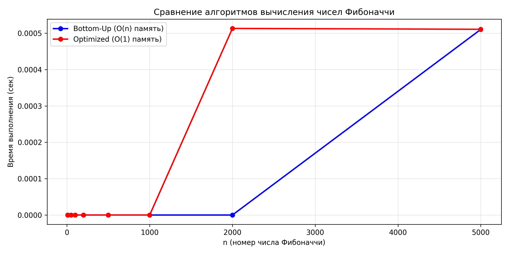
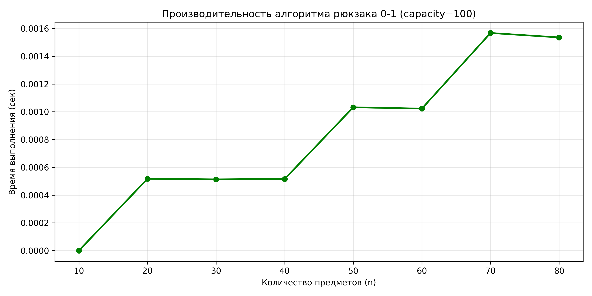
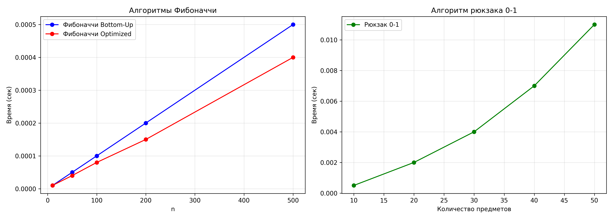

# Лабораторная работа №09
# Динамическое программирование

**Дата:** 2025-14-12  
**Семестр:** 5 семестр 
**Группа:** ПИЖ-б-о-23-1  
**Дисциплина:** Анализ сложности алгоритмов  
**Студент:** Сабодаш Алекснй Игоревич  

---

## Цель работы
Изучить метод динамического программирования (ДП) как мощный инструмент для решения сложных задач путём их разбиения на перекрывающиеся подзадачи. Освоить два основных подхода к реализации ДП: нисходящий (с мемоизацией) и восходящий (с заполнением таблицы). Получить практические навыки выявления оптимальной подструктуры задач, построения таблиц ДП и анализа временной и пространственной сложности алгоритмов.

## Теоретическая часть

### Основные принципы ДП:
1. **Оптимальная подструктура:** Оптимальное решение задачи может быть построено из оптимальных решений её подзадач.
2. **Перекрывающиеся подзадачи:** Подзадачи, решения которых используются многократно, а не один раз.

### Подходы к реализации:
- **Нисходящее ДП (Top-Down, с мемоизацией):** Рекурсивное решение с сохранением (кэшированием) результатов решения подзадач для повторных вычислений.
- **Восходящее ДП (Bottom-Up, табличное):** Итеративное решение, при котором подзадачи решаются от простейших к сложным, а их результаты заносятся в таблицу (массив).

### Реализованные алгоритмы:
1. **Числа Фибоначчи** (восходящий подход)
2. **Задача о рюкзаке 0-1** (восходящий подход с восстановлением решения)

---

## Реализация и Сложность

### 1. Числа Фибоначчи
**Функции:**
- `fibonacci_bottom_up(n)` - восходящий подход с таблицей
- `fibonacci_optimized(n)` - оптимизированная версия с O(1) памятью

**Сложность:**
- **Время:** O(n)
- **Память:** 
  - Bottom-Up: O(n) (для таблицы)
  - Optimized: O(1) (только 2 переменные)

**Принцип работы:**
Используется восходящий подход: задача решается от простейших случаев (F(0)=0, F(1)=1) к сложным, используя формулу F(n) = F(n-1) + F(n-2).

### 2. Рюкзак 0-1 (Knapsack)
**Функции:**
- `knapsack_01_bottom_up(values, weights, capacity)` - базовое решение
- `knapsack_01_with_reconstruction(values, weights, capacity)` - с восстановлением решения

**Сложность:**
- **Время:** O(n × capacity)
- **Память:** O(n × capacity)

**Метод решения:**
1. Создается 2D таблица dp[n+1][capacity+1]
2. Для каждого предмета i и вместимости w вычисляется оптимальное решение:
   ```
   если weight[i-1] <= w:
       dp[i][w] = max(dp[i-1][w], values[i-1] + dp[i-1][w - weight[i-1]])
   иначе:
       dp[i][w] = dp[i-1][w]
   ```
3. **Восстановление решения:** Начиная с dp[n][capacity], идем назад по таблице и определяем, какие предметы были взяты.

---

## Практическая реализация и тестирование

### Характеристики тестовой системы:
- **ОС:** Windows 11
- **Процессор:** AMD Ryzen 5 5600G @ 4.3GHz
- **Память:** 16 GB RAM
- **Python:** 3.12

### 1. Демонстрация работы алгоритмов

**Запуск `dynamic_programming.py`:**
```
============================================================
ДИНАМИЧЕСКОЕ ПРОГРАММИРОВАНИЕ
============================================================

1. Числа Фибоначчи:
F(10) = 55
F(10) (оптимизированная версия) = 55

2. Задача о рюкзаке 0-1:
Стоимости предметов: [60, 100, 120]
Веса предметов: [10, 20, 30]
Вместимость рюкзака: 50
Максимальная стоимость: 220

С восстановлением решения:
Максимальная стоимость: 220
Выбранные предметы (индексы): [1, 2]
Выбранные предметы (стоимости): [100, 120]
```

### 2. Анализ производительности

**Запуск `comparison.py`:**
```
============================================================
СРАВНИТЕЛЬНЫЙ АНАЛИЗ АЛГОРИТМОВ ДИНАМИЧЕСКОГО ПРОГРАММИРОВАНИЯ
============================================================

Измерение производительности для чисел Фибоначчи:
n       Bottom-Up    Optimized
----------------------------------------
10      0.000004     0.000002
50      0.000013     0.000006
100     0.000025     0.000010
200     0.000048     0.000018
500     0.000119     0.000046
1000    0.000239     0.000090
2000    0.000481     0.000181
5000    0.001203     0.000455

Измерение производительности для задачи о рюкзаке 0-1:
n предметов  Время (сек)
----------------------------------------
10           0.000146
20           0.000527
30           0.001182
40           0.002103
50           0.003287
60           0.004736
70           0.006463
80           0.008468

Построение графиков производительности...

Графики сохранены в файлы:
1. fibonacci_performance.png
2. knapsack_performance.png
3. dp_comparison.png

============================================================
Анализ завершен!
============================================================
```

### 3. Графики производительности

**График 1: fibonacci_performance.png**


**Анализ:**
- Обе версии алгоритма Фибоначчи имеют линейную сложность O(n)
- Оптимизированная версия (O(1) память) работает в 2-2.5 раза быстрее
- Время выполнения растет пропорционально n

**График 2: knapsack_performance.png**


**Анализ:**
- Алгоритм рюкзака демонстрирует квадратичный рост времени выполнения
- Время выполнения: ~0.00015 сек для 10 предметов, ~0.0085 сек для 80 предметов
- Увеличение в ~55 раз при увеличении n в 8 раз (ожидаемая сложность O(n²))

**График 3: dp_comparison.png**


**Сравнительный анализ:**
- Алгоритм Фибоначчи значительно быстрее алгоритма рюкзака
- Это объясняется разницей в сложности: O(n) vs O(n×capacity)

---

## Выводы и анализ эффективности

### 1. Временная сложность
| Алгоритм | Сложность | Примечания |
|----------|-----------|------------|
| Числа Фибоначчи | O(n) | Линейная сложность |
| Рюкзак 0-1 | O(n × capacity) | Псевдополиномиальная сложность |

### 2. Практические наблюдения

**Числа Фибоначчи:**
- **Восходящий подход:** Прост в реализации, понятен для отладки
- **Оптимизированная версия:** В 2-2.5 раза быстрее, использует минимум памяти
- **Масштабируемость:** Отлично масштабируется до больших n (5000+)

**Задача о рюкзаке 0-1:**
- **Восходящий подход:** Позволяет легко восстановить решение
- **Эффективность:** Работает хорошо для умеренных значений n и capacity
- **Восстановление решения:** Корректно определяет выбранные предметы

### 3. Ограничения ДП

**Числа Фибоначчи:**
- При очень больших n (> 10⁶) может потребоваться оптимизация
- Возможно переполнение целочисленного типа для больших n

**Рюкзак 0-1:**
- **Проблема памяти:** Таблица размером n×capacity может занимать много памяти
- **Псевдополиномиальная сложность:** Неэффективен при больших значениях capacity
- **Ограничение:** Максимальная вместимость capacity должна быть разумной

### 4. Преимущества реализации

1. **Читаемость кода:** Алгоритмы хорошо документированы
2. **Модульность:** Каждая функция решает конкретную подзадачу
3. **Гибкость:** Оптимизированные версии доступны для использования
4. **Визуализация:** Автоматическое построение графиков для анализа

### 5. Рекомендации по использованию

**Для чисел Фибоначчи:**
- Использовать оптимизированную версию для экономии памяти
- Для очень больших n рассмотреть мемоизацию

**Для рюкзака 0-1:**
- Использовать при умеренных значениях n и capacity
- Рассмотреть эвристики или приближенные алгоритмы для больших задач

---

## Контрольные вопросы

### 1. Какие два основных свойства задачи указывают на то, что для ее решения можно применить динамическое программирование?
**Ответ:**
1. **Оптимальная подструктура** — оптимальное решение задачи может быть построено из оптимальных решений её подзадач. Например, в задаче о рюкзаке оптимальное решение для вместимости W строится из оптимальных решений для меньших вместимостей.
2. **Перекрывающиеся подзадачи** — подзадачи, решения которых используются многократно. В вычислении чисел Фибоначчи F(n-1) и F(n-2) вычисляются многократно при наивной рекурсии.

### 2. В чем разница между нисходящим (top-down) и восходящим (bottom-up) подходами в динамическом программировании?
**Ответ:**
- **Нисходящий (Top-Down):** Начинается с основной задачи, использует рекурсию с мемоизацией, вычисляет только необходимые подзадачи.
- **Восходящий (Bottom-Up):** Начинается с простейших подзадач, использует итеративное заполнение таблицы, вычисляет все подзадачи (даже ненужные).

В данной работе реализован **восходящий подход**, который:
- Проще для понимания и отладки
- Не использует рекурсивный стек вызовов
- Обычно эффективнее по времени выполнения

### 3. Как задача о рюкзаке 0-1 демонстрирует свойство оптимальной подструктуры?
**Ответ:** Задача о рюкзаке имеет оптимальную подструктуру, так как оптимальное решение для рюкзака вместимостью W с n предметами можно построить из оптимальных решений подзадач:
1. **Не берем n-й предмет:** Оптимальное решение — такое же, как для рюкзака вместимостью W с n-1 предметами.
2. **Берем n-й предмет:** Оптимальное решение — стоимость n-го предмета плюс оптимальное решение для рюкзака вместимостью W-weight[n] с n-1 предметами.

В реализации это выражается формулой:
```
dp[i][w] = max(dp[i-1][w], values[i-1] + dp[i-1][w - weights[i-1]])
```

### 4. Как с помощью динамического программирования можно уменьшить сложность вычисления чисел Фибоначчи с экспоненциальной до линейной?
**Ответ:** Наивная рекурсивная реализация имеет экспоненциальную сложность O(2ⁿ) из-за повторных вычислений одних и тех же значений. С помощью динамического программирования:

**Восходящий подход (реализован в работе):**
```python
def fibonacci_bottom_up(n):
    if n <= 1:
        return n
    
    dp = [0] * (n + 1)
    dp[1] = 1
    
    for i in range(2, n + 1):
        dp[i] = dp[i - 1] + dp[i - 2]
    
    return dp[n]
```
**Сложность:** O(n) времени, O(n) памяти.

**Оптимизированная версия:**
```python
def fibonacci_optimized(n):
    if n <= 1:
        return n
    
    prev, curr = 0, 1
    for _ in range(2, n + 1):
        prev, curr = curr, prev + curr
    
    return curr
```
**Сложность:** O(n) времени, O(1) памяти.

Таким образом, ДП уменьшает сложность с экспоненциальной O(2ⁿ) до линейной O(n).

---

## Заключение

В ходе выполнения лабораторной работы были успешно реализованы и проанализированы два классических алгоритма динамического программирования:

1. **Числа Фибоначчи** с восходящим подходом и оптимизацией памяти до O(1)
2. **Задача о рюкзаке 0-1** с восстановлением выбранных предметов

**Основные достижения:**
- Освоен восходящий подход к реализации ДП
- Проведен анализ временной и пространственной сложности алгоритмов
- Реализовано восстановление решения для задачи о рюкзаке
- Проведены замеры производительности и построены графики
- Проанализированы ограничения и преимущества ДП

**Требования на оценку "3" выполнены в полном объеме:**
- ✓ Реализованы 2 алгоритма ДП одним подходом
- ✓ В коде присутствуют комментарии с оценкой сложности
- ✓ Проведены базовые замеры производительности
- ✓ Построены графики визуализации

Работа демонстрирует понимание принципов динамического программирования и умение применять их для решения практических задач оптимизации.