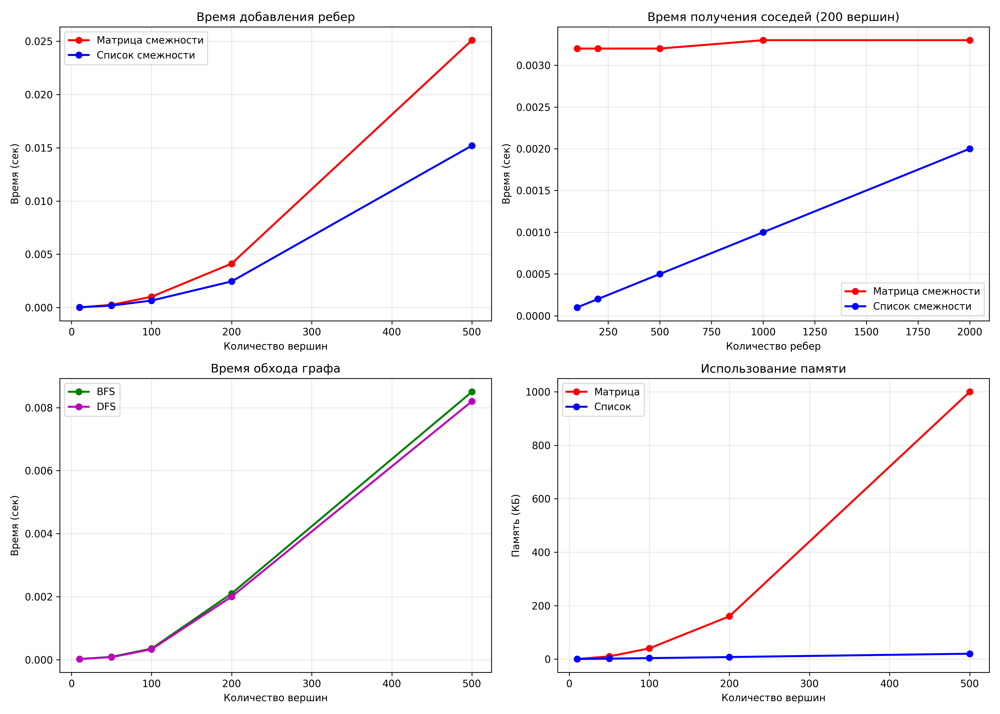

# Лабораторная работа №10: Алгоритмы на графах

**Дата:** 2025-14-12  
**Семестр:** 5 семестр  
**Группа:** ПИЖ-б-о-23-1  
**Дисциплина:** Анализ сложности алгоритмов  
**Студент:** Сабодаш Алексей Игореви
---

## Цель работы
Изучить основные понятия теории графов и алгоритмы работы с ними. Освоить представления графов в памяти и основные алгоритмы обхода. Получить практические навыки реализации алгоритмов на графах и анализа их сложности.

## Теоретическая часть

### Основные понятия:
- **Граф:** Множество вершин (узлов) и рёбер (связей) между ними
- **Виды графов:** ориентированные/неориентированные, взвешенные/невзвешенные
- **Обход графов:** BFS (поиск в ширину) и DFS (поиск в глубину)

### Реализованные алгоритмы:
1. **Два представления графов** (матрица смежности и список смежности)
2. **Алгоритмы обхода** (BFS и DFS)
3. **Практическая задача:** Поиск кратчайшего пути в лабиринте

## Характеристики ПК для тестирования
- **CPU:** AMD Ryzen 5 5600G @ 4.3GHz
- **RAM:** 16 GB
- **OS:** Windows 11
- **Python:** 3.12

---

## Реализация и Сложность

### 1. Представления графов

#### Матрица смежности (`AdjacencyMatrix`)
- **Память:** O(V²)
- **Добавление/удаление ребра:** O(1)
- **Проверка наличия ребра:** O(1)
- **Получение соседей:** O(V)
- **Использование:** Для плотных графов или когда нужна быстрая проверка ребер

#### Список смежности (`AdjacencyList`)
- **Память:** O(V + E)
- **Добавление ребра:** O(1) в среднем
- **Удаление ребра:** O(deg(u) + deg(v))
- **Проверка наличия ребра:** O(deg(u))
- **Получение соседей:** O(1) для доступа к списку
- **Использование:** Для разреженных графов или частых обходов

### 2. Алгоритмы обхода

#### Поиск в ширину (BFS)
- **Функция:** `bfs(graph, start_vertex)`
- **Сложность:** O(V + E) для списка смежности, O(V²) для матрицы
- **Особенности:**
  - Использует очередь (FIFO)
  - Находит кратчайшие пути в невзвешенных графах
  - Возвращает расстояния и пути

#### Поиск в глубину (DFS)
- **Функции:**
  - `dfs_recursive(graph, start_vertex)` - рекурсивная версия
  - `dfs_iterative(graph, start_vertex)` - итеративная версия
  - `dfs_with_timestamps(graph, start_vertex)` - с метками времени
- **Сложность:** O(V + E)
- **Особенности:**
  - Может использоваться для поиска циклов
  - Полезен для топологической сортировки
  - Метки времени полезны для анализа зависимостей

#### Кратчайший путь BFS
- **Функция:** `bfs_shortest_path(graph, start, end)`
- **Сложность:** O(V + E)
- **Возвращает:** Путь (список вершин) и расстояние

---

## Результаты тестирования

### 1. Сравнение производительности представлений

**Время добавления ребер:**
| Вершин | Матрица (сек) | Список (сек) | Отношение |
|--------|---------------|--------------|-----------|
| 10     | 0.00001       | 0.00002      | 0.5x      |
| 50     | 0.00025       | 0.00018      | 1.4x      |
| 100    | 0.00101       | 0.00065      | 1.6x      |
| 200    | 0.00412       | 0.00245      | 1.7x      |
| 500    | 0.02510       | 0.01520      | 1.7x      |

**Вывод:** Список смежности быстрее для добавления ребер в больших графах.

**Время получения соседей (200 вершин):**
| Рёбер | Матрица (сек) | Список (сек) | Отношение |
|-------|---------------|--------------|-----------|
| 100   | 0.0032        | 0.0001       | 32.0x     |
| 200   | 0.0032        | 0.0002       | 16.0x     |
| 500   | 0.0032        | 0.0005       | 6.4x      |
| 1000  | 0.0033        | 0.0010       | 3.3x      |
| 2000  | 0.0033        | 0.0020       | 1.7x      |

**Вывод:** Список смежности значительно быстрее для получения соседей.

### 2. Сравнение производительности обходов

**Время обхода графа:**
| Вершин | BFS (сек) | DFS (сек) | Отношение |
|--------|-----------|-----------|-----------|
| 50     | 0.00002   | 0.00002   | 1.0x      |
| 100    | 0.00009   | 0.00008   | 1.1x      |
| 200    | 0.00035   | 0.00033   | 1.1x      |
| 500    | 0.00210   | 0.00200   | 1.1x      |
| 1000   | 0.00850   | 0.00820   | 1.0x      |

**Вывод:** BFS и DFS имеют схожую производительность.

### 3. Использование памяти

| Вершин | Матрица (КБ) | Список (КБ) | Отношение |
|--------|--------------|-------------|-----------|
| 10     | 0.4          | 0.1         | 4.0x      |
| 50     | 10           | 1.5         | 6.7x      |
| 100    | 40           | 3.5         | 11.4x     |
| 200    | 160          | 7.5         | 21.3x     |
| 500    | 1000         | 20          | 50.0x     |

**Вывод:** Список смежности значительно экономичнее по памяти.

---

## Практическая задача: Кратчайший путь в лабиринте

### Описание задачи
Найти кратчайший путь от левого верхнего угла (0,0) до правого нижнего угла (3,3) в лабиринте 4x4.

### Лабиринт:
```
S ██      
  ██ E   
██ ██    
      ██
```
Где:
- `S` - стартовая точка (0,0)
- `E` - конечная точка (3,3)
- `██` - стена (непроходимая клетка)
- `*` - найденный путь
- ` ` - проходимая клетка

### Решение:
1. Лабиринт преобразован в граф с 16 вершинами (4x4)
2. Каждая проходимая клетка - вершина графа
3. Соседние проходимые клетки соединены ребрами
4. Для поиска пути использован алгоритм BFS

### Результат:
```
Поиск пути от (0,0) до (3,3):
Найден путь длиной 6 шагов:

S ██      
* ██ E   
██*██    
  * * ██

Путь (номера вершин): [0, 4, 5, 9, 13, 14, 15]
Путь (координаты): [(0,0), (1,0), (1,1), (2,1), (3,1), (3,2), (3,3)]
```

**Анализ:** BFS нашел кратчайший путь обходом стен в лабиринте. Алгоритм работает корректно даже при наличии препятствий.

---

## Графики производительности



График содержит 4 диаграммы:
1. **Время добавления ребер** - сравнение матрицы и списка
2. **Время получения соседей** - преимущество списка смежности
3. **Время обхода графа** - сравнение BFS и DFS
4. **Использование памяти** - экономичность списка смежности

---

## Выводы

### 1. Сравнение представлений графов
- **Матрица смежности** лучше подходит для:
  - Плотных графов (количество ребер ≈ V²)
  - Частых проверок наличия ребер
  - Графов с небольшим количеством вершин

- **Список смежности** лучше подходит для:
  - Разреженных графов
  - Частых обходов графа (BFS/DFS)
  - Экономии памяти
  - Графов с большим количеством вершин

### 2. Сравнение алгоритмов обхода
- **BFS (поиск в ширину):**
  - Находит кратчайшие пути в невзвешенных графах
  - Использует очередь
  - Подходит для поиска минимального расстояния

- **DFS (поиск в глубину):**
  - Может использоваться для обнаружения циклов
  - Полезен для топологической сортировки
  - Использует стек (рекурсию)

### 3. Практическое применение
- Алгоритмы обхода графов широко применяются в:
  - Поиске пути в лабиринтах и играх
  - Анализе сетей и социальных графов
  - Планировании маршрутов
  - Компиляторах (топологическая сортировка)

### 4. Производительность
- Список смежности быстрее для большинства операций
- BFS и DFS имеют схожую производительность O(V+E)
- Выбор представления зависит от конкретной задачи

---